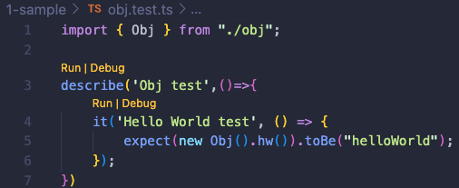

# Jest Mocking

## Introduction

In software engineering, unit testing is crucial to the functionality, maintainability, and reliability of the code base.
By isolating the smallest testable unit (a function, class, etc.) and abstracting away its dependencies, it is possible to validate the robustness and accuracy of each unit.

In order to focus on the unit under test itself, we must often mock dependencies of the unit under test.
This way we can simplify our tests and force our unit under test to flow through different logical branches of the code - all without relying on any external systems or potentially changing implementations.

[Jest](https://jestjs.io/) is one of the most common testing frameworks for testing Javascript Code.
[TS-Jest](https://www.npmjs.com/package/ts-jest) provides seamless integration between TypeScript (TS) and Jest, enabling the testing of code and writing of tests in TS.
Not only does Jest now integrate with TS, it also has fully fledged mocking functionality that allows us to write high quality unit tests.

In order to follow best practices and maintain consistency/standards across our unit tests as a crew in the future, we have put together samples with explanations of how to utlize mocking in different unit testing scenarios.

## Getting Started

Use this tutorial to understand some quick and beneficial ways of mocking your code's dependencies.

Each scenario directory (outlined in the [Table of Contents](./README.md#table-of-contents) below) contains an associated `README.md` explaining the scenario and real code/test files.

## Build and Test

To build and run tests:

- From the root, use `npm i` to install all project dependencies
- To run all the tests, run `npm run test`
- To run the specific test suite from a section of the tutorial, run `npm run test:#`.
*For instance if you'd like to run the tests from section 2, run `npm run test:2`.*

Or if you are using VSCode, utilize the [Jest Runner Extension](https://marketplace.visualstudio.com/items?itemName=firsttris.vscode-jest-runner) and click the `Run` or `Debug` anchor at the top of each suite or each individual test as shown below:

## Table of Contents

- [1-Mocking-Instances-Of-Classes](./1-Mocking-Instances-Of-Classes/README.md)
- [2-Static-Functions](./2-Static-Functions/README.md)
- [3-Testing-With-Environment-Vars](./3-Testing-With-Environment-Vars/README.md)
